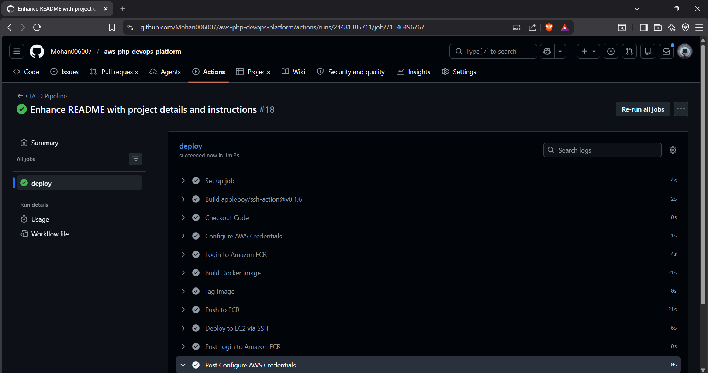
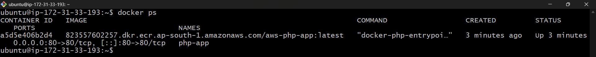
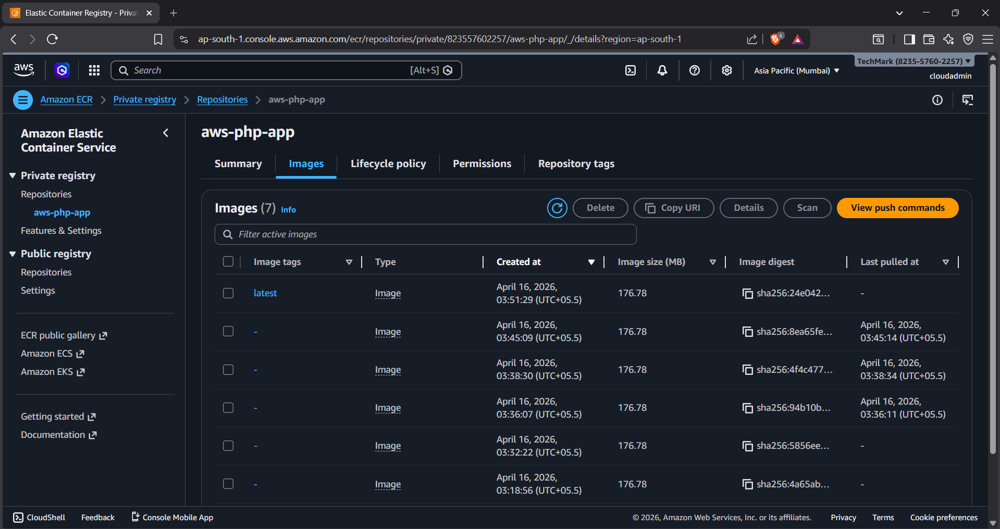
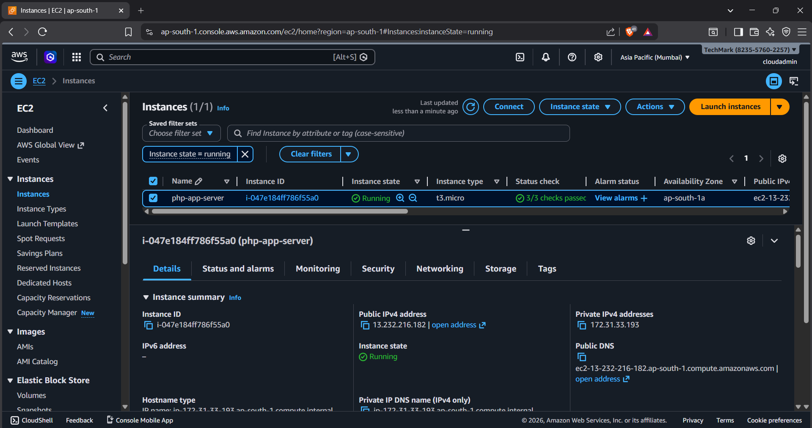
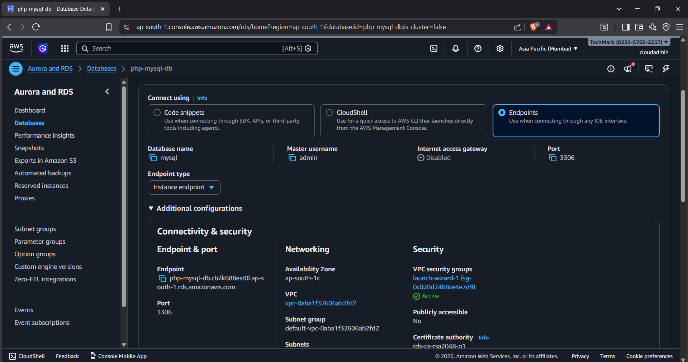
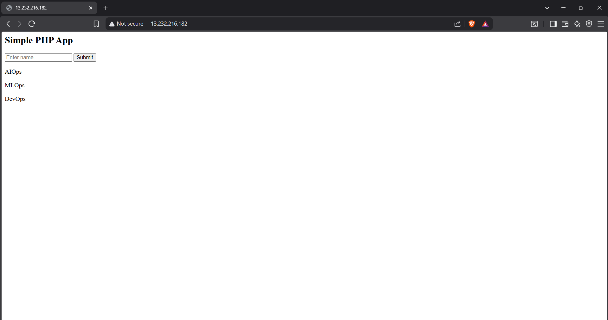

# 🚀 AWS PHP DevOps Platform

Production-ready deployment of a containerized PHP application using **Docker, AWS (EC2, ECR, RDS), and GitHub Actions CI/CD**.

---

## 📌 Overview

This project demonstrates a complete **end-to-end DevOps workflow**:

- Build a PHP application  
- Containerize using Docker  
- Push image to Amazon ECR  
- Deploy on EC2  
- Connect with RDS (MySQL)  
- Automate everything using GitHub Actions  

---

## 🏗️ Architecture

GitHub → GitHub Actions → Docker → Amazon ECR → EC2 → RDS

---

## ⚙️ Tech Stack

- **AWS** → EC2, ECR, RDS  
- **Docker** → Containerization  
- **GitHub Actions** → CI/CD  
- **PHP** → Backend  
- **MySQL (RDS)** → Database  

---

## 🔄 CI/CD Pipeline

The pipeline automatically:

1. Checks out code  
2. Configures AWS credentials  
3. Builds Docker image  
4. Pushes image to ECR  
5. Connects to EC2 via SSH  
6. Pulls latest image  
7. Runs container  

---

## 📸 Screenshots

### ✅ CI/CD Pipeline Success


### 🐳 Docker Container Running (EC2)


### 📦 Amazon ECR Repository


### ☁️ EC2 Instance Running


### 🗄️ Amazon RDS (MySQL)


### 🌐 Application Output


---

## 📂 Project Structure
```
aws-php-devops-platform/
│
├── app/ # PHP application
├── docker/ # Dockerfile
├── .github/workflows/ # CI/CD pipeline
├── README.md
└── .gitignore
```
---

## 🔐 Secrets Used

Stored in GitHub Secrets:

- AWS_ACCESS_KEY_ID  
- AWS_SECRET_ACCESS_KEY  
- AWS_REGION  
- ECR_REPOSITORY  
- EC2_HOST  
- EC2_USER  
- EC2_SSH_KEY  
- DB_PASSWORD  

---

## 🚀 How It Works

- Push code to `main` branch  
- GitHub Actions triggers pipeline  
- Docker image is built and pushed to ECR  
- EC2 pulls latest image  
- Container runs automatically  
- Application connects to RDS  

---

## 🧠 Key Learnings

- CI/CD pipeline implementation  
- Docker image lifecycle  
- AWS service integration  
- Secure credential management  
- Real-world deployment flow  

---

## 👨‍💻 Author

**Mohan**  
Aspiring AI & DevOps Engineer  

GitHub: https://github.com/Mohan006007  

---
